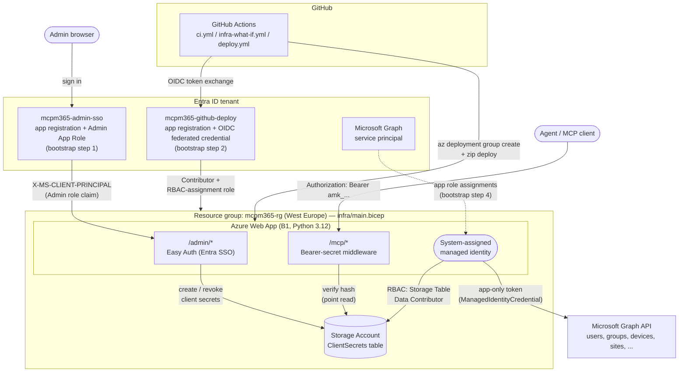

# One-time bootstrap

These steps aren't expressible in Bicep (Entra app registrations require Graph API
calls, not ARM) and only need to run once per environment, by a human with
`Application Administrator` (or `Cloud Application Administrator`) rights in Entra ID.

## Architecture

The two Entra app registrations created in steps 1-2 below, and the Microsoft
Graph permission grant in step 4, are what wire the pieces in this diagram
together — everything else (the Web App, its managed identity, Storage) comes
from `infra/main.bicep`.



## 1. Admin SSO app registration (Easy Auth)

```bash
APP_NAME="mcpm365-admin-sso"
APP_ID=$(az ad app create --display-name "$APP_NAME" \
  --sign-in-audience AzureADMyOrg \
  --query appId -o tsv)

# Optional, not required for Easy Auth to work (authSettings.bicep's
# allowedAudiences matches the plain client ID a standard OIDC sign-in
# actually issues -- see the comment there). Harmless to set regardless.
az ad app update --id "$APP_ID" --identifier-uris "api://$APP_ID"

# Add an "Admin" App Role that /admin/* checks for in the X-MS-CLIENT-PRINCIPAL claim
az ad app update --id "$APP_ID" --app-roles '[
  {
    "allowedMemberTypes": ["User"],
    "description": "Can manage MCP agent client secrets",
    "displayName": "Admin",
    "id": "'"$(python3 -c "import uuid; print(uuid.uuid4())")"'",
    "isEnabled": true,
    "value": "Admin"
  }
]'

# Create the enterprise application (service principal) and require assignment,
# so only explicitly assigned users can sign in at all
SP_ID=$(az ad sp create --id "$APP_ID" --query id -o tsv)
az ad sp update --id "$SP_ID" --set appRoleAssignmentRequired=true

# Assign yourself (or the intended admin) to the Admin role
ADMIN_USER_OBJECT_ID=$(az ad signed-in-user show --query id -o tsv)
ADMIN_ROLE_ID=$(az ad app show --id "$APP_ID" --query "appRoles[?value=='Admin'].id" -o tsv)
az rest --method POST \
  --uri "https://graph.microsoft.com/v1.0/servicePrincipals/$SP_ID/appRoleAssignments" \
  --body "{\"principalId\":\"$ADMIN_USER_OBJECT_ID\",\"resourceId\":\"$SP_ID\",\"appRoleId\":\"$ADMIN_ROLE_ID\"}"

echo "adminAadClientId=$APP_ID"   # feed into infra/main.bicep's adminAadClientId param

# Required: Easy Auth v2's AAD provider defaults to the confidential-client
# auth code flow, which needs this secret to exchange the code for a token
# server-side at /.auth/login/aad/callback. Without it, sign-in 401s right
# after Entra auth succeeds. Feed the output into the ADMIN_AAD_CLIENT_SECRET
# GitHub secret (infra/main.bicep's adminAadClientSecret param) -- it expires
# (2 years here), so it needs rotating with the same command before then.
az ad app credential reset --id "$APP_ID" --append --display-name "easy-auth" --years 2 --query "password" -o tsv
```

Redirect URI (add after the Web App exists, via `az ad app update --id "$APP_ID"
--web-redirect-uris "https://<webAppHostName>/.auth/login/aad/callback"`), and
grant `openid`/`profile` delegated Microsoft Graph permissions if prompted.

## 2. GitHub Actions OIDC federated credential

```bash
DEPLOY_APP_ID=$(az ad app create --display-name "mcpm365-github-deploy" --query appId -o tsv)
az ad sp create --id "$DEPLOY_APP_ID"

REPO="mybesttools/mcp-m365-mgmt"

az ad app federated-credential create --id "$DEPLOY_APP_ID" --parameters '{
  "name": "github-pr",
  "issuer": "https://token.actions.githubusercontent.com",
  "subject": "repo:'"$REPO"':pull_request",
  "audiences": ["api://AzureADTokenExchange"]
}'

az ad app federated-credential create --id "$DEPLOY_APP_ID" --parameters '{
  "name": "github-main",
  "issuer": "https://token.actions.githubusercontent.com",
  "subject": "repo:'"$REPO"':ref:refs/heads/main",
  "audiences": ["api://AzureADTokenExchange"]
}'
```

### Role assignments for the deploy identity (scoped to the resource group)

Plain `Contributor` cannot grant RBAC roles (it excludes
`Microsoft.Authorization/roleAssignments/write`), but the pipeline needs to grant
the Web App's managed identity `Storage Table Data Contributor` on every deploy.
Create a minimal custom role for just that, in addition to `Contributor`:

```bash
RG="<your-resource-group>"
SUB_ID=$(az account show --query id -o tsv)

az role definition create --role-definition '{
  "Name": "MCP Deploy Role Assigner",
  "IsCustom": true,
  "Description": "Allows assigning roles, scoped down for CI/CD deploy identities",
  "Actions": ["Microsoft.Authorization/roleAssignments/write", "Microsoft.Authorization/roleAssignments/read", "Microsoft.Authorization/roleAssignments/delete"],
  "AssignableScopes": ["/subscriptions/'"$SUB_ID"'/resourceGroups/'"$RG"'"]
}'

az role assignment create --assignee "$DEPLOY_APP_ID" --role "Contributor" --scope "/subscriptions/$SUB_ID/resourceGroups/$RG"
az role assignment create --assignee "$DEPLOY_APP_ID" --role "MCP Deploy Role Assigner" --scope "/subscriptions/$SUB_ID/resourceGroups/$RG"
```

(Fallback if the custom role is too much process for v1: grant `User Access
Administrator` instead of the custom role — simpler, broader blast radius if the
deploy identity is ever compromised.)

## 3. GitHub repository secrets

Set these under **Settings > Secrets and variables > Actions** -- specifically
the *Actions* tab, not *Codespaces* (a separate secret store that looks
similar but workflows can't read from it; easy to pick the wrong one).

| Secret | Value |
|---|---|
| `AZURE_CLIENT_ID` | `$DEPLOY_APP_ID` from step 2 |
| `AZURE_TENANT_ID` | `az account show --query tenantId -o tsv` |
| `AZURE_SUBSCRIPTION_ID` | `az account show --query id -o tsv` |
| `AZURE_RESOURCE_GROUP` | the target resource group name |
| `ADMIN_AAD_CLIENT_ID` | `$APP_ID` from step 1 |
| `ADMIN_AAD_CLIENT_SECRET` | output of the `az ad app credential reset` command in step 1 |
| `SECRET_PEPPER` | generate once: `openssl rand -base64 32` |

`SECRET_PEPPER` is used to HMAC every agent client secret before it's stored in
Table Storage. **Rotating it invalidates every issued secret at once** — there's
no per-secret rotation story in this build (Key Vault, which would allow
versioned/rotatable signing keys, was explicitly deferred). Treat it as
effectively permanent once agents are relying on issued secrets.

## 4. Grant Microsoft Graph permissions to the Web App's managed identity (run after the first deploy)

The system-assigned managed identity doesn't exist until the Web App is
provisioned, so this can't happen before the first `deploy.yml` run and can't
live in Bicep (Graph application-permission grants are Graph API calls, not
ARM). It's deliberately **not** wired into the pipeline either: granting Graph
app roles requires Global Administrator or Privileged Role Administrator in
Entra ID, and handing that level of privilege to the CI deploy identity would
undercut the least-privilege scoping done for it in step 2. Run this manually,
once, right after the first successful deploy — and again if the set of Graph
tools this server calls ever changes.

```bash
RG="<your-resource-group>"
MI_PRINCIPAL_ID=$(az deployment group show -g "$RG" -n main \
  --query properties.outputs.webAppPrincipalId.value -o tsv)
GRAPH_SP_ID=$(az ad sp show --id 00000003-0000-0000-c000-000000000000 --query id -o tsv)

# Inferred from the Microsoft Graph endpoints mcp_m365_mgmt.py actually calls
# (users, groups, sites, deviceManagement/*, deviceAppManagement/*). Reconcile
# this against whatever permissions your existing local-dev app registration
# (AUTH_MODE=app's AZURE_CLIENT_ID) already has granted -- that's the proven
# working baseline; this list is a best-effort derivation, not a guarantee.
PERMISSIONS=(
  "User.ReadWrite.All"
  "Group.ReadWrite.All"
  "Sites.ReadWrite.All"
  "DeviceManagementManagedDevices.ReadWrite.All"
  "DeviceManagementConfiguration.ReadWrite.All"
  "DeviceManagementServiceConfig.ReadWrite.All"
  "DeviceManagementApps.ReadWrite.All"
)

for PERM in "${PERMISSIONS[@]}"; do
  ROLE_ID=$(az ad sp show --id "$GRAPH_SP_ID" --query "appRoles[?value=='$PERM'].id" -o tsv)
  echo "Granting $PERM ($ROLE_ID) to managed identity $MI_PRINCIPAL_ID"
  az rest --method POST \
    --uri "https://graph.microsoft.com/v1.0/servicePrincipals/$MI_PRINCIPAL_ID/appRoleAssignments" \
    --body "{\"principalId\":\"$MI_PRINCIPAL_ID\",\"resourceId\":\"$GRAPH_SP_ID\",\"appRoleId\":\"$ROLE_ID\"}"
done
```

Re-running is safe for permissions already granted -- that specific `POST` call
returns a 400 for a duplicate assignment, which you can ignore; it does not
affect permissions granted in an earlier run.
